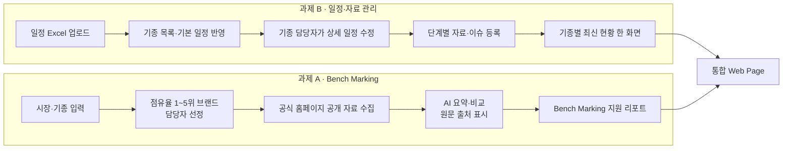

# 선행품질 업무 지원 통합 웹 Agent — 프로젝트 기획서

| 항목 | 내용 |
|---|---|
| 리포 | data09-11 |
| 제출자 | 노윤호 |
| 직무·소속 | 건설장비 선행품질파트 |
| 과정 | 현장 데이터 디지털화 전문가과정 1차수 |
| 작성일 | 2026-09-28 |
| 문서 상태 | 초안 v0.1 — 수강생 제출 자료 기반 |

제출 원문의 게시물 제목은 「개발품질관리 Agent」이고, 첨부 기획안의 가칭은 「선행품질 업무 지원 통합 웹 Agent」입니다. 이 문서는 첨부 기획안의 가칭을 프로젝트명으로 씁니다.

하나의 통합 웹 페이지 안에 성격이 다른 두 과제가 들어 있으므로, 이 문서는 두 과제를 다음과 같이 나누어 적습니다.

- **과제 A** — Bench Marking 경쟁사 비교 분석 Agent (첨부 기획안의 「기능 1」)
- **과제 B** — 개발 기종 일정·자료(Issue) 관리 페이지 (첨부 기획안의 「기능 2」)

**1차 개발 대상은 과제 B입니다.** 이유는 8장에 적습니다.

---

## 1. 추진 배경과 현안

선행품질은 양산 이전 개발 단계에서 제품의 품질 이슈를 미리 확인하고 예방하는 업무입니다.
한 담당자가 여러 기종(예: 2톤 굴착기)을 동시에 맡고 있습니다.

### 1.1 공통 배경

- 현재의 사내 프로그램과 사이트만으로는 담당하는 모든 기종의 이력을 관리하고 확인하기에 번거로움이 있습니다.
- 자동화가 필요한 항목을 자동화하여 담당자가 불필요하게 쓰는 Man Hour를 줄이는 것이 목적입니다.

### 1.2 과제 A — Bench Marking

| 현재 상황 | 그로 인한 문제 |
|---|---|
| 경쟁사 홈페이지에서 정비 매뉴얼, Spec sheet, 영업용 브로셔를 수작업으로 수집·정리 | 기종 개발 전 조사에 많은 시간이 소요됨 |

- 개발 기종의 검증 목표를 수립할 때, Agent를 통해 Study하고 목표를 설정하고자 합니다.

### 1.3 과제 B — 기종별 일정·자료(Issue) 관리

| 현재 상황 | 그로 인한 문제 |
|---|---|
| 담당자 각자의 자료가 본인 PC에만 저장 | 직접 찾을 수는 있으나 번거롭고, 다른 사람이 자료를 확인하기 어려움 |
| 담당 기종이 많음 | 놓치는 자료(이슈)와 일정이 발생함 |
| 사내 프로그램·사이트만으로는 전 기종 이력 관리에 한계 | 기종별 이력 확인이 번거로움 |

- 실무 수행 중 일정·Issue 관리 페이지가 없어 일정과 자료가 누락되는 것을 막고자 합니다.

## 2. 목표

### 2.1 최종 목표

- Bench Marking 자료 조사를 자동화하여 담당자의 Man Hour를 절감합니다.
- 기종별 자료와 일정을 한곳에서 관리하여 자료·일정 누락을 방지합니다.
- 두 기능을 하나의 웹 사이트(통합 Web Page, Agent)로 묶어 팀원에게 링크로 공유합니다.

### 2.2 1차 개발 목표

- **과제 B의 핵심 화면**을 먼저 만듭니다. 개발 기종 일정 Excel을 올리면 기종 목록·단계별 일정이 한 화면에 반영되고, 기종별 이슈와 자료 목록을 기록·조회·수정·삭제할 수 있는 브라우저 도구입니다.
- 과제 A는 1차에서 **담당자가 직접 내려받은 공개 브로셔·카탈로그 PDF를 올리면 AI가 출처를 붙여 비교 요약**하는 형태까지만 시험합니다. 자동 서칭·수집은 2단계로 미룹니다.

## 3. 보유 데이터

| 데이터 | 형태 | 규모·주기 | 비고(민감도 등) |
|---|---|---|---|
| 개발 기종 일정표 | Excel | 규모 미상. 한 명이 갱신하는 방식 | 사내 개발 일정 — 사내 한정. 항목·양식 미확정(확인 필요) |
| 기종·개발 단계별 자료 | PDF, Excel, PPT, JPEG, PNG 등 | 규모 미상. 담당자별 개인 PC에 분산 | 개발 중 기종 자료 — 보안 등급 확인 필요 |
| 업무 메일 | Outlook MSG | 규모 미상 | 사내 커뮤니케이션 — 민감 |
| 경쟁사 공개 자료 | 기종별 브로셔, 카탈로그, Spec sheet, 정비 매뉴얼 (공식 홈페이지) | 대상 시장·기종마다, 점유율 1~5위 브랜드 | 공식 홈페이지에서 누구나 접근·다운로드 가능한 자료만 대상. 저작권은 출처 표시로 대응 |

실제 일정 Excel과 이슈 기록 샘플은 아직 받지 못했습니다(10장).

## 4. 해결 방안 개요

| 단계 | 과제 A | 과제 B |
|---|---|---|
| 수집 | 브랜드별 공식 홈페이지의 브로셔·카탈로그 (1차는 담당자가 직접 내려받아 업로드) | 개발 기종 일정 Excel, 단계별 자료 파일, 이슈 기록 |
| 정리 | 브랜드·기종별로 문서 분류, 스펙 항목 추출 | 기종 × 개발 단계 × 일정 구조로 정규화 |
| 분석·AI | 신규 도입 기능, Sales Point, 스펙 비교 요약(출처 포함) | 일정 지연·임박 항목, 미해결 이슈 표시 |
| 산출물 | Bench Marking 지원 리포트 | 기종별 일정·자료·이슈 현황 화면 |

## 5. 주요 기능

### 5.1 과제 B — 기종별 일정·자료(Issue) 관리 (1차 개발 대상)

| 기능 | 설명 | 우선순위 |
|---|---|---|
| 일정 Excel 가져오기 | 개발 기종 일정 Excel을 올리면 기종 목록과 개발 단계별 기본 일정을 자동 반영 | MVP |
| 기종 관리 | 기종 추가 / 수정 / 삭제 | MVP |
| 상세 일정 수정 | 변동이 잦은 기종별 상세 일정을 기종 담당자가 직접 수정 | MVP |
| 일정 현황 화면 | 기종별·단계별 일정을 한 화면(표·간트형)으로 보여 주고, 임박·지연 일정을 강조 | MVP |
| 이슈 관리 | 기종·단계별 이슈 등록, 상태(열림/조치중/종결), 담당자, 기한 기록 (가정 — 이슈 항목 구성은 확인 필요) | MVP |
| 자료 목록 관리 | 개발 단계마다 자료(PDF, Excel, PPT, JPEG, PNG 등)를 조회 / 업로드 / 수정 / 삭제 | MVP(목록·링크) / 확장(파일 저장소) |
| 내보내기 | 현황을 Excel로 다시 내려받기 | MVP |
| 수정·삭제 이력 | 누가 무엇을 바꿨는지 기록, 실수로 지운 자료 복구 | 확장 |
| 사내 일정 시스템 직접 연동 | 사내 전용 접속이 가능하면 Excel 업로드 대신 직접 연동 | 확장 |

### 5.2 과제 A — Bench Marking 경쟁사 비교 분석

| 기능 | 설명 | 우선순위 |
|---|---|---|
| 대상 시장·기종 입력 | 분석할 시장·기종 지정 (예: 2톤 굴착기 시장) | MVP |
| 브랜드 선정 | 시장 점유율 1~5위 브랜드를 기종 담당자가 선정·기록 | MVP |
| 공개 자료 업로드 | 담당자가 내려받은 브로셔·카탈로그·Spec sheet를 브랜드별로 등록 | MVP |
| AI 요약·비교 | 신규 도입 기능, Sales Point, 스펙 비교를 정리. 모든 요약에 원문 출처 표시 | MVP |
| Bench Marking 지원 리포트 | 결과를 문서(표·요약)로 내려받기 | MVP |
| 검증 목표 수립 지원 | 비교 결과를 바탕으로 개발 기종 검증 목표 초안을 제안 | 확장 |
| 공개 자료 자동 서칭·수집 | 선정 브랜드 공식 홈페이지에서 공개 자료를 자동 수집 | 확장 |

## 6. 기대 산출물

1. **기종별 일정·자료 관리 페이지** — 기종별 개발 단계 일정과 보유 자료·이슈를 조회 / 업로드 / 수정 / 삭제
2. **Bench Marking 분석 페이지** — 경쟁사 자료를 모아 AI가 요약·비교(출처 포함)
3. **통합 Web Page (Agent)** — 위 두 페이지를 하나의 사이트로 묶어 팀원에게 링크 공유
4. 부수 산출물: 일정 Excel 표준 양식(가져오기용), Bench Marking 리포트 양식

## 7. 기술 구성

| 과정 도구 | 이 프로젝트에서 쓰는 곳 |
|---|---|
| DAY1 암묵지 자산화·전략기획 | 기종·개발 단계·이슈 항목 정의, 자료 분류 체계 설계 |
| DAY2 코랩(Python)·바이브코딩 | 일정 Excel 구조 분석, 지연·임박 계산 로직 시험 |
| DAY3 멀티모달 비정형 정보화 | 브로셔·카탈로그 PDF와 이미지에서 스펙 표 추출(OCR) |
| DAY4 RAG (Dify, NotebookLM) | 경쟁사 공개 자료를 지식으로 넣고 출처 인용 요약 — 과제 A의 1차 시험은 NotebookLM으로 바로 가능 |
| DAY5 Make 자동화 | 일정 임박·이슈 기한 알림 메일 (확장) |
| 생성형 AI | 신규 기능·Sales Point 요약, 검증 목표 초안 |

**개발 형태(권장)**

- **과제 B — 설치 없이 브라우저에서 도는 정적 웹 도구**로 만듭니다. Excel 읽기·쓰기는 브라우저 안에서 처리(SheetJS 계열)하고, 1차 데이터는 브라우저 저장소 + Excel 내보내기/가져오기로 보관합니다. 사내 자료를 외부 서버에 올리지 않아도 1차 시험이 가능합니다.
- 팀 공유(여러 명이 같은 데이터를 보고 고치는 것)는 **저장 위치가 정해져야** 가능합니다. 사내 서버, 사내 SharePoint/Teams, 외부 클라우드 DB 중 무엇이 허용되는지 확인 후 2단계에서 붙입니다(10장).
- **과제 A — 1차는 NotebookLM 또는 Dify 지식베이스**로 공개 자료 요약을 시험하고, 통합 페이지에는 결과 리포트 보기·내려받기 화면을 둡니다. 자동 수집은 브랜드별 사이트 구조가 달라 별도 Python 수집기가 필요합니다(2단계, 가정).

## 8. 개발 단계

### 1차 개발 대상 선정 이유 — 과제 B

- 과제 B는 **외부 사이트나 AI 서비스 없이** 사내 Excel만으로 동작하므로, 보안 확인 전에도 브라우저 안에서 바로 만들고 써 볼 수 있습니다.
- 제출 원문의 현안(「일정/Issue 관리 Page 미구현으로 인한 일정&자료 누락 방지」)을 직접 해결합니다.
- 과제 A의 자동 서칭은 브랜드별 홈페이지 구조, 자료 공개 범위, 사내 망에서의 외부 접속 가능 여부를 먼저 확인해야 합니다.

### 1단계 — 지금 바로 개발 가능한 부분

**과제 B**

- 브라우저 도구: 기종 추가·수정·삭제, 개발 단계별 일정 입력, 이슈 기록(상태·담당자·기한), 자료 목록(파일명·단계·링크·메모) 관리
- 일정 Excel 가져오기: 실제 양식을 받기 전까지는 **표준 양식(기종 / 개발 단계 / 시작일 / 종료일 / 담당자)을 가정**하고 만들며, 열 이름 매핑 화면을 두어 실제 양식에 맞출 수 있게 합니다.
- 현황 화면(기종별 간트형 표, 임박·지연 강조)과 Excel 내보내기
- 데이터는 브라우저 안에만 저장(개인용 시험판)

**과제 A**

- NotebookLM(또는 Dify)에 담당자가 내려받은 공개 브로셔 몇 건을 넣어 「신규 기능 / Sales Point / 스펙 비교 + 출처」 형식의 요약 프롬프트를 확정합니다.
- 통합 페이지에는 시장·기종 입력, 브랜드 1~5위 선정 기록, 리포트 붙여넣기·보기 화면만 둡니다.

### 2단계

- 팀 공유 저장소 연결(허용되는 위치 확정 후): 여러 명이 같은 기종·일정·이슈를 보고 수정, 첨부 파일 실제 업로드
- 수정·삭제 이력과 복구
- 과제 A: 스펙 표 추출(DAY3 OCR)로 브랜드 간 스펙 비교표 자동 작성, Dify 에이전트로 통합 페이지 안에서 질의

### 3단계

- 사내 전용 접속과 기존 일정 시스템 직접 연동
- 과제 A: 선정 브랜드 공식 홈페이지 공개 자료 자동 서칭·수집, 신규 자료 감지
- Make로 일정 임박·이슈 기한 알림, Bench Marking 결과를 검증 목표 초안으로 연결

## 9. 기대 효과

| 구분 | 기대 효과 |
|---|---|
| 업무 시간 절감 | 경쟁사 자료의 수작업 수집·정리 시간이 줄어 Man Hour 절감 |
| 조사 품질 향상 | Bench Marking 전에 경쟁사의 신규 기능·Sales Point를 먼저 파악하여 준비 가능 |
| 자료 접근성 향상 | 개인 PC에 흩어진 자료를 기종·단계별로 모아 쉽게 조회 |
| 누락 방지 | 담당 기종이 많아도 자료(이슈)와 일정을 한곳에서 점검 가능 |
| 업무 연속성 | 자료가 개인 PC가 아닌 공용 위치에 남아 다른 담당자도 확인 가능 (가정) |

제출 자료에는 절감 시간 등 정량 수치가 없어 이 문서도 수치를 적지 않습니다.

## 10. 확인 필요 사항

**보안·운영 (제출 기획안의 「추후 확인 필요 사항」 포함)**

1. 사내 임직원만 접근 가능한 링크(사내 전용 접속)로 제작할 수 있는지 — 링크 공유만으로는 링크를 받은 누구나 접근할 수 있습니다.
2. 업로드된 자료를 어디에 저장할 수 있는지(사내 서버, SharePoint/Teams, 외부 클라우드 허용 여부)와 사내 보안 기준 충족 여부
3. 모든 접근자가 수정·삭제할 수 있으므로 실수로 지운 자료의 복구 방식
4. 개발 중 기종 자료를 외부 AI 서비스(NotebookLM, Dify, OpenAI 등)에 넣어도 되는지 — 과제 A의 공개 자료는 문제없더라도 과제 B 자료는 별도 판단이 필요합니다.

**데이터·양식**

5. 개발 기종 일정 Excel 실물(또는 개인정보를 지운 샘플) — 열 이름, 개발 단계 명칭, 한 파일에 담긴 기종 수
6. 이슈 관리에 필요한 항목(이슈 번호, 분류, 심각도, 조치 내용, 종결일 등)과 현재 이슈를 기록하는 곳
7. 개발 단계 구분(단계 이름·순서)이 전 기종 공통인지
8. Outlook MSG 메일을 어떤 용도로 쓰려는지(이슈 근거 첨부인지, 메일에서 이슈를 뽑아내려는 것인지)

**과제 A**

9. 1차 시험 대상 시장·기종 1건과 점유율 1~5위 브랜드, 해당 브랜드의 공개 브로셔 샘플
10. 비교에 꼭 필요한 스펙 항목(예: 운전중량, 버킷 용량 등 — 가정)과 리포트 양식
11. 사내 망에서 경쟁사 홈페이지 접속·다운로드가 가능한지(자동 수집 가능 여부)

## 부록. 제출 원문 요약

| 출처 | 파일·게시물 | 내용 |
|---|---|---|
| 패들릿 게시물 1 (2026-09-28T06:16) | 「개발품질관리 Agent」 — `기획_원문.md` | 직무·소속(건설장비 선행품질파트), 현안 2건(Bench Marking Agent, 개발 기종 일정/Issue 관리 Page), 보유 데이터(PPT, Excel, Outlook MSG, Image), 기대 산출물 |
| 첨부 PDF | `att/01___________Agent____.pdf` (본문 추출 `att/01___________Agent____.pdf.txt`) — 「선행품질 업무 자동화 웹 Agent 구축 기획안」 초안(작성일 2026.09.28) | 개요·용어, 추진 배경, 목표·산출물 3종, 주요 기능 2종, Flow Chart 3종(그림 1~3), 기대 효과, 확정 운영 원칙, 추후 확인 필요 사항 |

첨부 PDF는 텍스트 추출로 전체를 읽었습니다. 읽지 못한 첨부는 없습니다.
